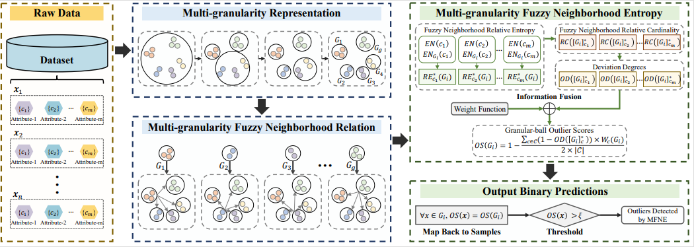

# MFNE
Granular-Ball Fuzzy Neighborhood Entropy-based Outlier Detector (SUBMISSION TO IEEE TRANSACTIONS ON FUZZY SYSTEMS, PyTorch Code)

## Abstract
Outlier detection has become a key research focus in data mining, aiming to identify rare objects that significantly deviate from normal patterns. Fuzzy neighborhood rough sets, as an important granular computing model, provide a powerful tool for handling uncertainty information in data. However, existing fuzzy neighborhood rough outlier detectors rely on a fixed paradigm that uses single-granularity samples as the basic processing unit. This paradigm leads to low efficiency, sensitivity to noise, and underutilization of multi-granularity information, ultimately impairing outlier detection performance. Granular-ball computing, by representing data with multi-granularity granular-balls, offers an effective framework for fusing and leveraging multi-granularity information, enabling more comprehensive extraction of abnormal features. Based on this, we propose a Multi-granularity Fuzzy Neighborhood Entropy-based outlier detector (MFNE). In MFNE, we first integrate granular-ball computing with fuzzy neighborhood rough sets to develop a multi-granularity fuzzy neighborhood rough sets model and extend existing uncertainty measures. Subsequently, we propose a multi-granularity fuzzy neighborhood relative entropy fusion strategy, which leverages this approach to effectively utilize the uncertainty information in the data. Finally, we calculate the outlier scores of granular-balls by fusing the deviation degrees of multiple multi-granularity fuzzy neighborhood information granules and map these scores back to individual samples to obtain their outlier scores. Extensive experiments demonstrate that MFNE outperforms state-of-the-art methods on 16 datasets, validating its effectiveness.

## Framework


## Directory Structure
```
.
├── code/                                 # Source code
│   └── GB_generation_with_idx.py         # Granular-ball generation
│   └── MFNE.py                           # Main entry point
├── datasets/                             # Benchmark datasets used in the paper
├── paper/                                # Original paper
│   └── 10__Multi_Granularity_Fuzzy_Neighborhood_Entropy_based_Outlier_Detector__IEEE_TFS_.pdf
│   └── MFNE_structure.png
└── README.md                             # Project readme
```

## Usage

### 1. Install dependencies
Ensure Python 3.8+ is installed. Required packages include:

- numpy  
- scikit-learn  

Install with:

```bash
pip install numpy scikit-learn
```

### 2. Run the code
```bash
cd code
python MFNE.py        # CPU Version
python MFNE_GPU.py    # GPU Version
```

You can run MFNE.py or MFNE_GPU.py:
```python
if __name__ == '__main__':
    data = pd.read_csv("../datasets/german_1_14_variant1.csv").values
    X = data[:, :-1]
    n, m = X.shape
    labels = data[:, -1]
    ID = (X >= 1).all(axis=0) & (X.max(axis=0) != X.min(axis=0))
    scaler = MinMaxScaler()
    if any(ID):
        scaler = MinMaxScaler()
        X[:, ID] = scaler.fit_transform(X[:, ID])

    GBs = get_GB(X)
    n_gb = len(GBs)
    centers = np.zeros((n_gb, m))
    for idx, gb in enumerate(GBs):
        centers[idx] = np.mean(gb[:,:-1], axis=0)
        
    sigma = 0.4
    OS = MFNE(centers, sigma)
    print(OS)
```
You can get outputs as follows:
```
 [0.61810519 0.476508   0.55795211 0.47738712 0.40488144 0.47360436
 0.51416924 0.50475107 0.48193672 0.39391336 0.5024665  0.41648201
 0.43143542 0.43761512 0.44074641 0.38099356 0.38445389 0.43670695
 0.43401526 0.47438091 0.41090235 0.44450291 0.42851428 0.51255193
 ...
 0.36842907 0.38859235 0.43734825 0.4371114  0.4900863  0.49939251
 0.42014589 0.41487138 0.4540908  0.44362296 0.43237219 0.40901834
 0.51001329 0.47341489 0.46614148 0.47034675 0.508689   0.55854198
 0.47660625 0.45357573 0.44615111 0.42795297 0.44402034 0.4564456
 0.44459692 0.40616626 0.44780287 0.42514779 0.48054545 0.49344408]
```
```
